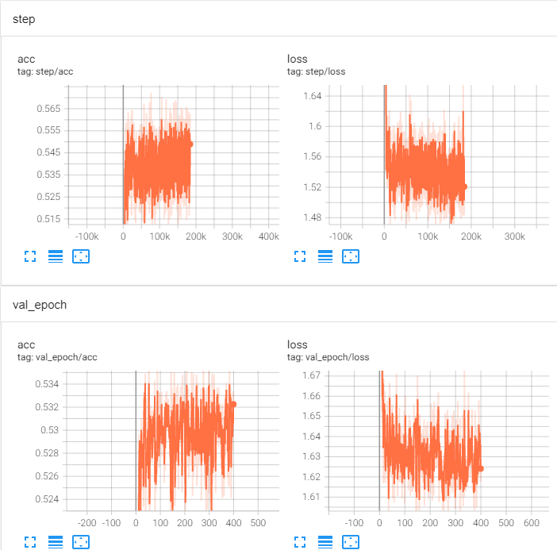
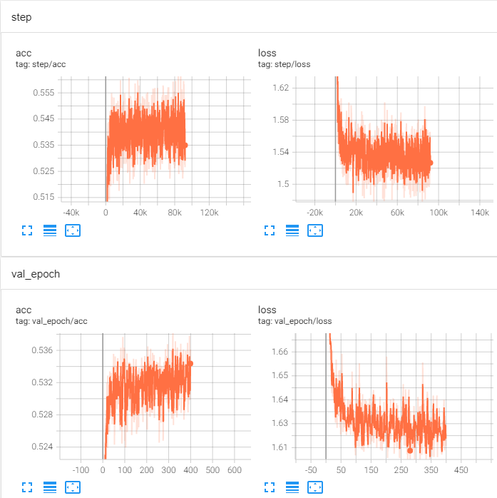
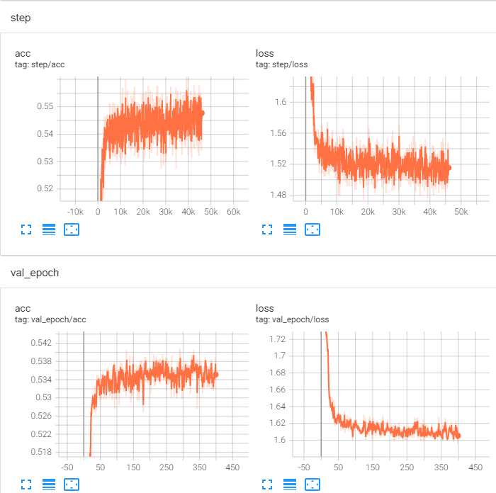

# 实验问题记录

## 1. 训练过程不稳定
- 描述：
> 在所有类型地baseline模型中，都出现了这个问题。具体表现为训练过程中loss一直在振荡，摆动幅度较大，loss下降和acc上升都比较缓慢。可能是模型收敛到了局部极值点。
- 原因：
> 1. `batch_size(4096)`过小
> 2. `损失函数(交叉熵)`不合适
> 3. `学习率(lr=0.004, weight_decay=5e-4)`太大
> 4. `优化器(Adam)`是否合适
> 5. 特征未进行`归一化/标准化`
> 6. 中间层没有`normalization`
> 7. 模型参数初始化
- 解决：
1. 调整batch_size  
>- `batch_size=2048`
>
>
>- `batch_size=4096`
>  
>
>- `batch_size=8192`  
>
>- 结论  
> 可以明显看出，当batch_size增大后，训练集和验证集上的loss和acc抖动都没那么剧烈了。增大bs(batch_size)时，更新参数时参考了更多的样本信息，收到噪音、数据偏差的影响更小，能够沿着更"准确"的方向更新参数。但是显然增大bs对显存的要求更高，可以通过`累计梯度`来解决这个问题，或者多卡训练。

2. 对特征进行标准化/归一化
>归一化后效果下降很明显，且更不稳定
>标准化后效果确有提升，提升至48.46484

3. 增加了模型的图卷积层数
>使用graphconv模型，模型层数增加至3层，但是降低了邻居节点采样数量，并降低了batch_size
>

---

## 2. baseline的graphattn模型表现最差
- 描述：
> 在三种baseline模型中，graphattn在训练集上的最高准确度是baseline中最低的，在验证集上也是如此

