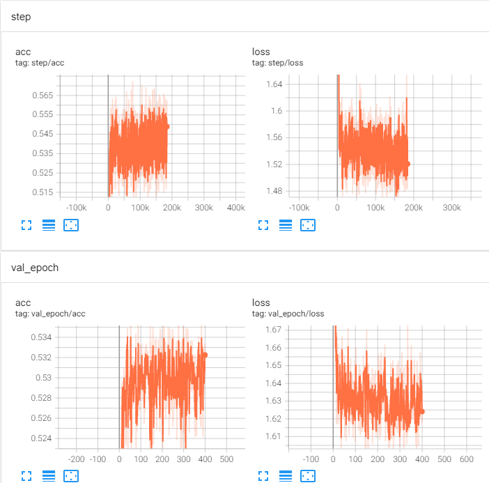
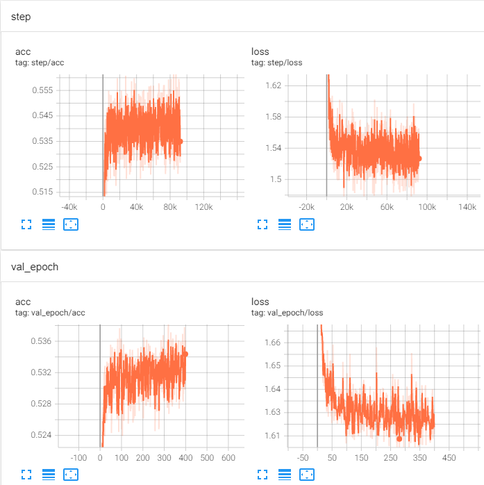
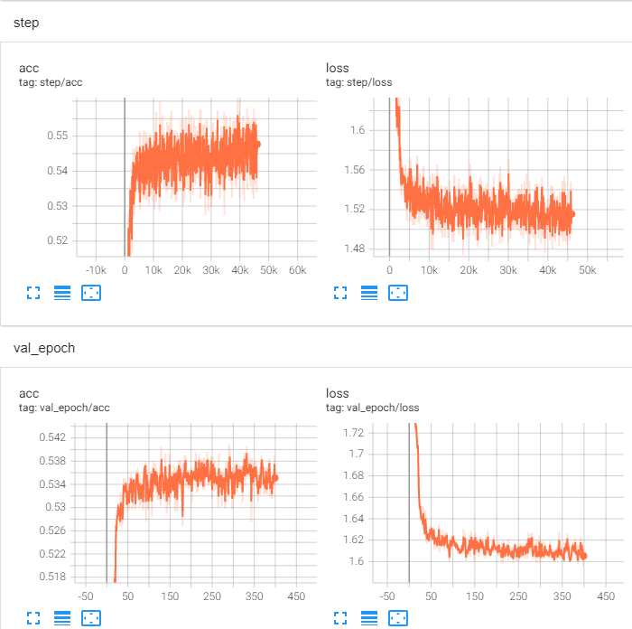
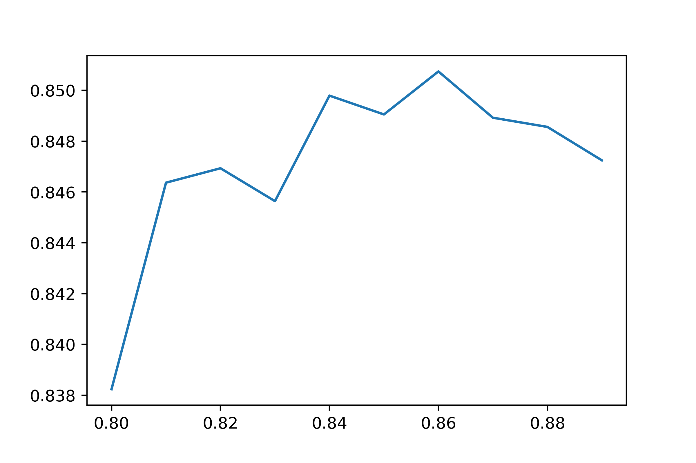
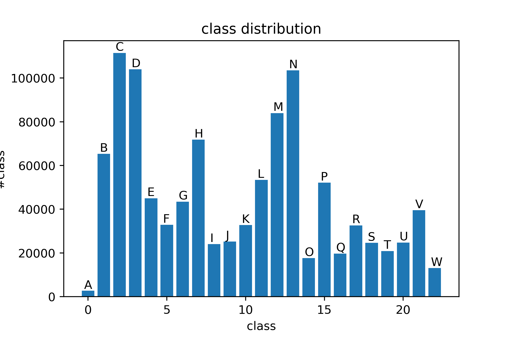

# 实验问题记录

## 1. 训练过程不稳定
- 描述：
> 在所有类型地baseline模型中，都出现了这个问题。具体表现为训练过程中loss一直在振荡，摆动幅度较大，loss下降和acc上升都比较缓慢。可能是模型收敛到了局部极值点。
- 原因：
> 1. `batch_size(4096)`过小
> 2. `损失函数(交叉熵)`不合适
> 3. `学习率(lr=0.004, weight_decay=5e-4)`太大
> 4. `优化器(Adam)`是否合适
> 5. 特征未进行`归一化/标准化`
> 6. 中间层没有`normalization`
> 7. 模型参数初始化
- 解决：
1. 调整batch_size  
>- `batch_size=2048`
>
>
>- `batch_size=4096`
>  
>
>- `batch_size=8192`  
>
>- 结论  
> 可以明显看出，当batch_size增大后，训练集和验证集上的loss和acc抖动都没那么剧烈了。增大bs(batch_size)时，更新参数时参考了更多的样本信息，收到噪音、数据偏差的影响更小，能够沿着更"准确"的方向更新参数。但是显然增大bs对显存的要求更高，可以通过`累计梯度`来解决这个问题，或者多卡训练。

2. 对特征进行标准化/归一化
>归一化后效果下降很明显，且更不稳定
>标准化后效果确有提升，提升至48.46484

3. 增加了模型的图卷积层数
>使用graphconv模型，模型层数增加至3层，但是降低了邻居节点采样数量，并降低了batch_size
>

4. 在交叉熵损失函数中增加了类别权重
>类别权重由类别样本数量计算得到，但是样本数量差距较大的类别权重差别并不是很大。使用这种权重得到的线上效果并不佳，与之前的几次实验相比效果反有下降。

---

## 2. baseline的graphattn模型表现最差
- 描述：
> 在三种baseline模型中，graphattn在训练集上的最高准确度是baseline中最低的，在验证集上也是如此

---

## 3. 后处理
- 描述
>使用模型计算测试集的概率后，通过一些策略/方法对概率进行矫正
- 方法：
1. CAN
>参考论文[When in Doubt: Improving Classification Performance with Alternating Normalization](https://arxiv.org/abs/2109.13449)。对预测后的概率进行矫正，但是耗时太长，实验了一次后发现效果并不好，ACC反而下降了。
2. 结点类别与其邻居结点类别分布的关系
>通过邻居节点的类别分布对训练集和测试集中的结点的类别进行推测，当邻居类别中的主类占比超过0.86时，则认为结点也属于主类。推测得到了测试集中14214个，训练集中39064个结点的类别。在实验中经过检验，确实提高了线上效果。但是提高的比预估的少，实际只提高了0.1413612，预估应提高0.5034191。
>  
>上图表示随着主类占比阈值的提高，在训练集中推测正确的准确率，最后采用的阈值是0.86。
3. 通过计算向量相似性找到游离结点的相似节点
>

---

## 4. GPU显存不足
- 描述
>由于数据集中的引文网络较大，涉及到的模型参数较多，当模型复杂、batch_size增大后容易出现显存不足的问题
- 方法：
1. 累计梯度
>训练时使用较小的batch_size，但是更新梯度时每隔几个batch更新一次。经过实验，`batch_size(4096)` $\times$ `accumulation(2)`达到了新的最佳效果。  
>但累计梯度后的batch_size并不完全等价于直接使用该batch_size，分多次采样得到的子图并不等价。

--- 

## 5. 数据分析
- 描述
>挖掘有效/无效的特征，探索数据与任务的关系
- 方法：
1. 特征重要性
>发掘对分类任务比较重要的特征，提出不重要的特征，以节省空间

---

## 6. 类别不平衡问题
- 描述
>23个类别中，部分类别的结点数量偏少
>

--

## 7. 关于模型的一些超参数
- 描述 
>图模型的一些超参数
- 方法：
1. 邻居节点采样数量
>邻居节点采样数量为10时效果优于20
2. 

---

## 8. 超参数优化
- 描述
>模型、训练过程，涉及到很多超参数，如何找到最优的一组？
- 方法：
1. 网格搜索
>...
2. 贝叶斯优化
>

## 9. 其他
- 描述
>一些其他问题
1. DGL的结点采样器（MultiLayerNeighborSampler），采样得到的邻居并不一定是固定的，是随机的
>因此，同一个模型，因为采样的邻居不一样，所以预测的结果也会不一样